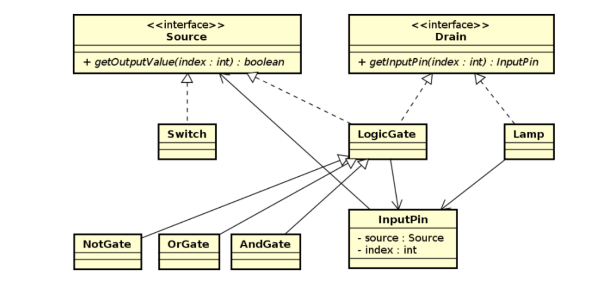

# digital-circuit-simulator

This project aims to implement a simulator in which the user can select a digital circuit and visualize its output for each possible input. The system architecture must use the architectural pattern known as Model-View-Controller. In particular, you should use three packages:

• Model. Classes responsible for representing the data and logic of the program. In the case of this project, the classes are responsible for representing the circuit components and their respective behavior.

• Eyesight. Classes responsible for representing the graphical interface of the program. In the case of this project, the classes are responsible for representing a Swing window and all widgets contained in it, particularly those representing circuit components.

• Controller. Classes resposnsible for connecting the model with the view. They detect model changes and update the view accordingly, or they detect user interactions and update the model accordingly.

## model

